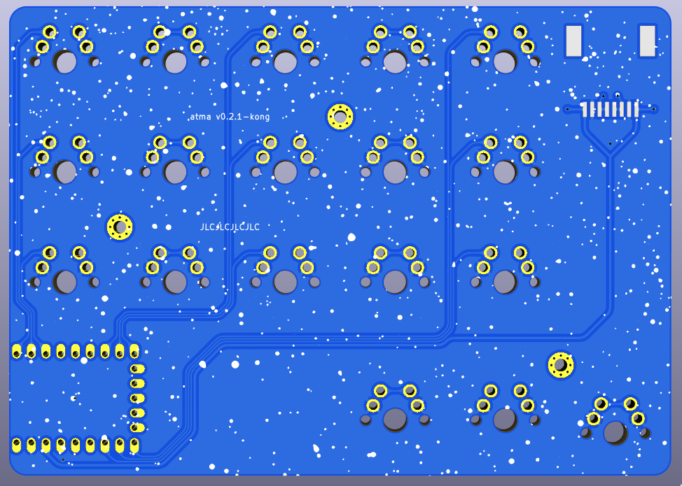
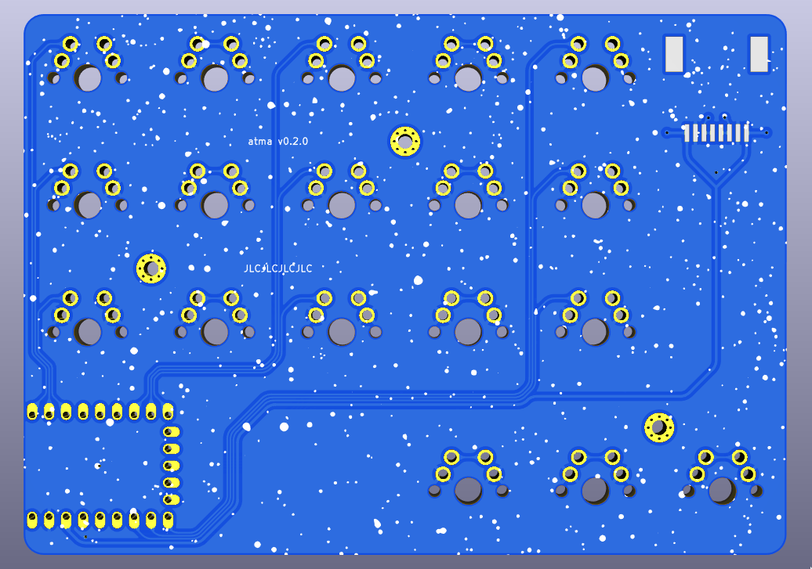
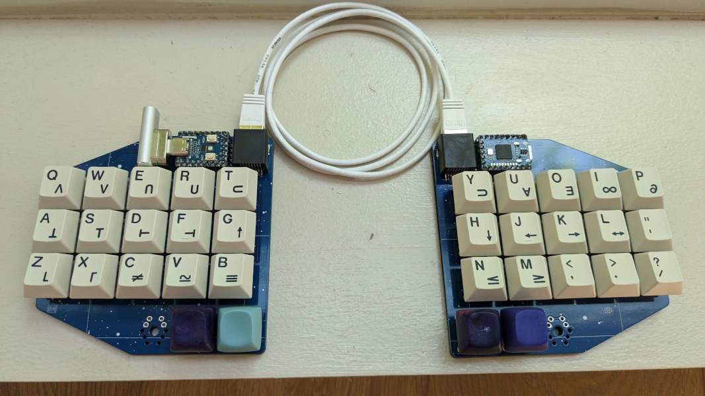

# atma

 

- 36 key ortholinear split keyboard
- Waveshare RP2040 Zero
- Diodeless, reversible PCB
- RJ45 split comms

## bom

- 2 PCB (see `prod/gerber`)
- 2 Waveshare RP2040 Zero
- 2 Molex 0441440003 ([DigiKey](https://www.digikey.com/en/products/detail/molex/0441440003/761960))
- 36 MX switches and keycaps
- (optional) 6 M2 6MM bolts and nuts to fasten extra PCBs as bottom plates.

## versions

- [v0.2.1-kong](#v021-kong) ([release](https://github.com/sboysel/atma/releases/tag/v0.2.1-kong)): same as v0.2.0 but with the outer thumb key dropped a few millimeters (similar to weteor/Kong).
- [v0.2.0](#v020) ([release](https://github.com/sboysel/atma/releases/tag/v0.2.0)): more ergonomic thumb cluster
- [v0.0.1](#v001) ([release](https://github.com/sboysel/atma/releases/tag/v0.0.1)): Initial prototype. Tested and functional. A diodeless ~~clone of~~ homage to [skarrmann/janus](https://github.com/skarrmann/janus) with RP2040 Zero.

### v0.2.1-kong

### v0.2.0

### v0.0.1

